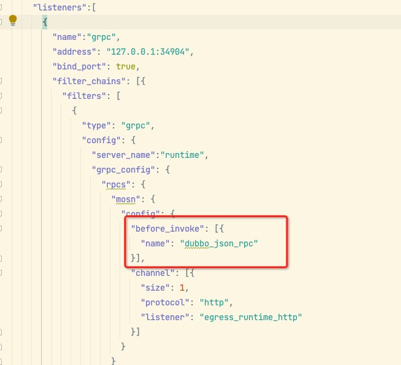

# Dubbo JSON RPC Example
*Note: This demo needs to run under go v1.17*
## Quick Start
### step 1. Edit config file，add `dubbo_json_rpc` filter



### step 2. Compile and start layotto
```shell @if.not.exist layotto
go build -o layotto cmd/layotto/main.go
```

```shell @background
./layotto -c demo/rpc/dubbo_json_rpc/example.json
```

### step 3. Start dubbo server

use `dubbo-go-samples` repo's example server.

```shell @catch
git clone https://github.com/apache/dubbo-go-samples.git
```

```shell
cd dubbo-go-samples
git reset --hard f0d1e1076397a4736de080ffb16cd0963c8c2f9d

# start zookeeper
cd rpc/jsonrpc/go-server
docker-compose -f docker/docker-compose.yml up -d

# build && start dubbo server
cd cmd
export DUBBO_GO_CONFIG_PATH="../conf/dubbogo.yml"
```

```shell @background
go run .
```

### step 4. call runtime InvokerService api.
```shell @cd ${project_path}
go run demo/rpc/dubbo_json_rpc/dubbo_json_client/client.go -d '{"jsonrpc":"2.0","method":"GetUser","params":["A003"],"id":9527}'
```


## Next Step

If you are interested in the implementation principle, or want to extend some functions, you can read [RPC design document](en/design/rpc/rpc-design-doc.md)
