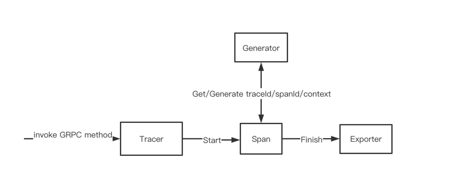

# 可观测性

## Trace管理

### 功能介绍

在[runtime_config.json](https://github.com/mosn/layotto/blob/main/configs/runtime_config.json) 中，有一段关于trace的配置如下：

```json
[
  "tracing": {
    "enable": true,
    "driver": "SOFATracer",
    "config": {
      "generator": "mosntracing",
      "exporter": ["stdout"]
    }
  }
]
```
这段配置可以开启layotto的trace能力，让layotto在接到请求后打印链路追踪日志。用户可以通过配置来指定trace日志上报的方式，以及spanId,traceId等字段的生成方式。

可以按照如下方式启动一个layotto的server：

构建:

```shell
cd cmd/layotto_multiple_api/
go build -o layotto
```

运行:

```shell @background
./layotto start -c ../../configs/runtime_config.json
```

对应的调用端代码在[client.go](https://github.com/mosn/layotto/blob/main/demo/flowcontrol/client.go) 中，运行它会调用layotto的SayHello接口：

```shell
 cd ${project_path}/demo/flowcontrol/
 go build -o client
 ./client
```

查看layotto的日志，会看到打印出详细的链路追踪日志：


### 配置参数说明

trace配置：

| 字段名 | 字段类型 | 说明 |
|  ----  | ----  | ---- |
| enable  | boolean | 全局开关，是否开启trace|
| driver  | String | driver是代表trace的类型，mosn现有SOFATracer和skywalking，用户可以拓展|
| config  | Object | trace的拓展配置 |

trace拓展配置：

| 字段名 | 字段类型 | 说明 |
|  ----  | ----  | ---- |
| generator  | String | spanId,traceId等资源的生成方式，用户可自行拓展|
| exporter  | Array | 用户需要trace上报的方式，可自行实现和拓展|

### Trace 原理

Layotto中的 Tracing 主要是对grpc调用进行记录，依赖于在grpc里添加的两个拦截器： [UnaryInterceptorFilter](https://github.com/mosn/layotto/blob/main/diagnostics/grpc_tracing.go) 、 [StreamInterceptorFilter](https://github.com/mosn/layotto/blob/main/diagnostics/grpc_tracing.go)

拦截器在每次grpc方法调用时都会开启一次tracing，生成traceId spanId、新的context，记录方法名、时间，并且会将tracing信息通过context透传下去，方法返回时将span信息导出。


### Trace 框架的设计
整体结构图:



#### Span结构：

```go
type Span struct {
    StartTime     time.Time //收到请求的时间
    EndTime       time.Time //返回的时间
    traceId       string   //traceId
    spanId        string  //spanId
    parentSpanId  string  //父spanId
    tags          [xprotocol.TRACE_END]string //拓展字段，component可以将自己的信息存放到该字段
    operationName string
}
```
Span结构定义了layotto和其component之间传递的数据结构，如下图所示，component可以通过tags将自己的信息传递到layotto，layotto做
统一的trace上报：

#### Generator接口：

```go
type Generator interface {
    GetTraceId(ctx context.Context) string
    GetSpanId(ctx context.Context) string
    GenerateNewContext(ctx context.Context, span api.Span) context.Context
    GetParentSpanId(ctx context.Context) string
}
```

该接口对应上面的generator配置，该接口主要用来根据收到的context生成traceId,spanId,获得父spanId以及传递给组件的context的功能，用户
可以实现自己的Generator，可以参考代码中的[OpenGenerator](https://github.com/mosn/layotto/blob/main/diagnostics/genetator.go) 的实现。

#### Exporter接口：

```go
type Exporter interface {
    ExportSpan(s *Span)
}
```

exporter接口定了如何将Span的信息上报给远端，对应配置中的exporter字段，该字段是个数组，可以上报给多个服务端。可以
参照[StdoutExporter](https://github.com/mosn/layotto/blob/main/diagnostics/exporter_iml/stdout.go) 的实现,该实现将trace的信息打印到标准输出。


#### Span的上下文传递：

##### Layotto侧
```go
GenerateNewContext(ctx context.Context, span api.Span) context.Context
```

GenerateNewContext用于生成新的context，我们通过mosnctx可以将该context实现上下文之间的互相传递：

```go
ctx = mosnctx.WithValue(ctx, types.ContextKeyActiveSpan, span)
```
可以参考代码中的[OpenGenerator](https://github.com/mosn/layotto/blob/main/diagnostics/genetator.go) 的实现

##### Component侧

在Component侧可以通过[SetExtraComponentInfo](https://github.com/mosn/layotto/blob/main/components/trace/utils.go) 塞入component的信息，
比如在[etcd configStore组件](https://github.com/mosn/layotto/blob/main/components/configstores/etcdv3/etcdv3.go) 执行了以下操作：

```go
	trace.SetExtraComponentInfo(ctx, fmt.Sprintf("method: %+v, store: %+v", "Get", "etcd"))
```

trace打印的结果如下：


## Metrics管理

layotto的metrics复用的mosn的metrics，对接prometheus。

[runtime_config.json](https://github.com/mosn/layotto/blob/main/configs/runtime_config.json) 中提供了metric配置的示例，按照上述步骤启动layotto后，可以通过以下指令读取 metrics 信息：


```shell
curl --location --request GET 'http://127.0.0.1:34903/metrics' 
```

结果如下图所示：


### 配置解释
解释一下[runtime_config.json](https://github.com/mosn/layotto/blob/main/configs/runtime_config.json) 里 metrics 相关配置

#### 埋点、统计


图中标红的这段配置会启用mosn的"grpc_metric" filter。这个filter的作用是在每次处理完grpc请求后，统计服务名、成功还是失败等信息，存在内存中。

详见 [mosn代码](https://github.com/mosn/mosn/blob/70751eae7a13dd1b3ac84c31b1ba85c45945ef69/pkg/filter/stream/grpcmetric/metric.go#L54)

#### 展示metrics数据
```json
  "metrics": {
    "sinks": [
      {
        "type": "prometheus",
        "config": {
          "port": 34903
        }
      }
    ]
  }
```

这段其实也是mosn的配置，会打开34903端口，按 prometheus 的数据格式返回内存中的 metrics 指标。

### 更多细节
mosn的 metrics 原理可以参照 [mosn官方文档](https://mosn.io/blog/code/mosn-log/)
